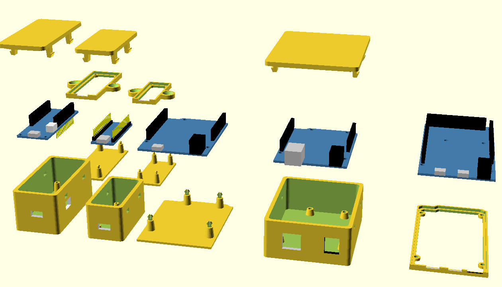
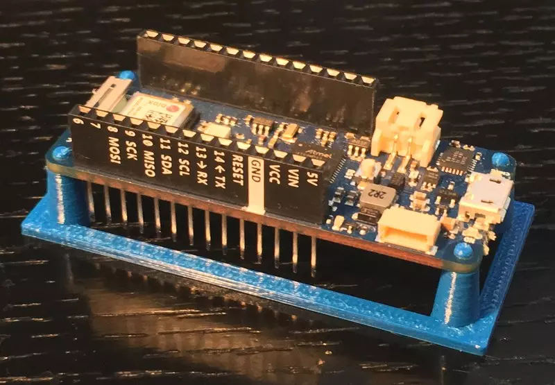

# OpenSCAD Arduino Mounting library

The library has a variety of modules for creating Arduinos and Arduino mounts. Here is a basic description of the included modules. It includes all official boards through the Due, plus the MKR WIFI 1010. For examples see the included example SCAD.



## Dependencies

Using the [library location instructions](https://en.wikibooks.org/wiki/OpenSCAD_User_Manual/Libraries),
checkout the `pin_connectors` library in the `libraries` folder, e.g on OSX this is done as follows:

    $ cd ~/Documents/OpenSCAD/libraries
    $ git clone https://github.com/tbuser/pin_connectors.git

This makes the `pin_connectors/pins.scad` dependency available.

If the `libraries` folder does not, exist, it will need to be created first. In the case of OSX:

    $ cd ~/Documents/OpenSCAD/
    $ mkdir -p libraries
    $ cd libraries
    $ git clone https://github.com/tbuser/pin_connectors.git

Follow the [instructions](https://en.wikibooks.org/wiki/OpenSCAD_User_Manual/Libraries) for your
platform.

## Arduino Mounting Library Functions

### arduino(boardType)
**boardType** - UNO, LEONARDO, DUEMILANOVE, DIECIMILA, DUE, MEGA, MEGA 2560, ETHERNET, NANO, MKR_WIFI_1010

*This module creates an Arduino board with USB connector, power supply and headers.*

### bumper(boardType, mountingHoles)
**boardType** - UNO, LEONARDO, DUEMILANOVE, DIECIMILA, DUE, MEGA, MEGA 2560, ETHERNET, NANO, MKR_WIFI_1010

**mountingHoles** - (OPTIONAL) True or false for external mounting holes for bumper.

*Create a simple bumper style encloser for a particular board*

### enclosure(boardType, wall, offset, heightExtension, cornerRadius, mountType, standOffHeight)
**boardType** - UNO, LEONARDO, DUEMILANOVE, DIECIMILA, DUE, MEGA, MEGA 2560, ETHERNET, NANO, MKR_WIFI_1010

**wall** - Thickness of enclosure walls. Default is 3.

**offset** - Distance of PCB from walls.

**heightExtension** - Additional space at the top of the box.

**cornerRadius** - Corner radius for outside of box.

**mountType** - TAPHOLE, PIN - How the standoffs attach to the board either using tap holes for screws or pins.

**standOffHeight** - The spacing between the enclosure bottom and the board. MKR_WIFI_1010 needs abot 10mm.

*Creates a box enclosure with a snap-on lid for a particular board*

### enclosureLid(boardType, wall, offset, cornerRadius, ventHoles)
**boardType** - UNO, LEONARDO, DUEMILANOVE, DIECIMILA, DUE, MEGA, MEGA 2560, ETHERNET, NANO, MKR_WIFI_1010

**wall** - Thickness of enclosure walls. Default is 3.

**offset** - Distance of PCB from walls.

**cornerRadius** - Corner radius for outside of box.

**ventHoles** - true, false for holes in the lid.

*Creates a lid for the box enclosure*

### standoffs(boardType, height, topRadius, bottomRadius, holeRadius, mountType)

**boardType** - UNO, LEONARDO, DUEMILANOVE, DIECIMILA, DUE, MEGA, MEGA 2560, ETHERNET, NANO, MKR_WIFI_1010

**height** - height of standoffs

**topRadius** - Radius of top of standoff cylinder.

**bottomRadius** - Radius of bottom of standoff cylinder.

**holeRadius** - Radius of tap hole in the standoff.

**mountType** - TAPHOLE, PIN, NOTCH recommended for FDM printing for small holes like on NANO and MKR_WIFI_1010

*This creates standoffs for mounting holes. These are simple cylinders that can be tapered. For custom standoffs use the holePlacement() module.*

### boardShape( boardType, offset, height )
**boardType** - UNO, LEONARDO, DUEMILANOVE, DIECIMILA, DUE, MEGA, MEGA 2560, ETHERNET, NANO, MKR_WIFI_1010

**offset** - creates the shape offset from actual board size. Negative values create an inset shape.

**height** - default is pcb height but can be any value needed.

*This creates the shape of the PCB with no holes. The default create a basic Uno PCB.*

### boundingBox(boardType, offset, height, cornerRadius, include)
**boardType** - UNO, LEONARDO, DUEMILANOVE, DIECIMILA, DUE, MEGA, MEGA 2560, ETHERNET, NANO, MKR_WIFI_1010

**offset** - creates the shape offset from actual board size. Negative values create an inset shape.

**height** - default is board height (including components) but can be any value needed.

**cornerRadius** -

**include** - BOARD, PCB, COMPONENTS What to include in bounding box, just the PCB, just the components or both (BOARD)

*This creates a box whos dimensions are the extremes of the board.*

### holePlacement(boardType)
**boardType** - UNO, LEONARDO, DUEMILANOVE, DIECIMILA, DUE, MEGA, MEGA 2560, ETHERNET, NANO, MKR_WIFI_1010

*This is used for placing holes and is the basis of the standoff module. holePlacement takes a child element and places it at each of the mounting hole centers for a given board.*


### components(boardType, component, extension, offset)
**boardType** - UNO, LEONARDO, DUEMILANOVE, DIECIMILA, DUE, MEGA, MEGA 2560, ETHERNET, NANO, MKR_WIFI_1010

**component** - ALL, HEADER\_F, HEADER\_M, USB, POWER, RJ45, HEADER\_BI

**extension** - Extention off the board in direction of connector. The default is the standard dimension of the connector, but can be set to an arbitrary value.

**offset** - Offsets the connector cube in the other two dimensions.

*Creates the components( headers, power and usb jacks) for a given board. Also used for creating punchout, by using the extension and offset values.*

## Examples

This creates a simple standoff for an Arduino MKR WIFI 1010.
```
    standoffs(MKR_WIFI_1010, height = 10, mountType=NOTCH);
    difference() {
      boardShape(MKR_WIFI_1010, offset = 3);
      translate([0,0,-0.005]) scale(1.01) boardShape(MKR_WIFI_1010);
    }

```

The notches might be difficult to clip in, use pliers to carefully apply force without damaging the board.
If the print is perfect, there should be a notable 'click', and the board should fit on without tension,
movable by a few microns.

